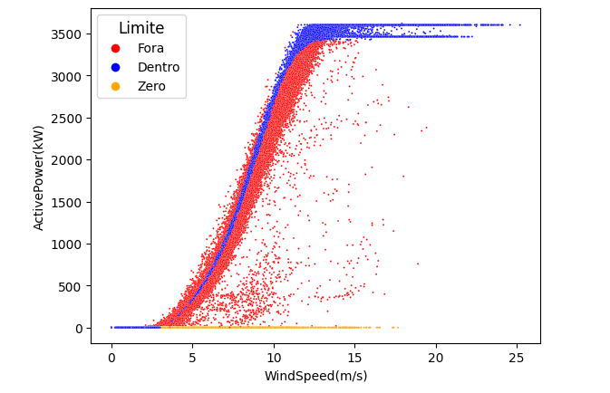

# Análise de Performance de Turbina Eólica

 

## Objetivo
Análise comparativa entre a potência real gerada e a curva teórica de uma turbina eólica, com classificação de desempenho em três categorias.

  
   

## Métricas Principais

✅ Dentro (azul): ±5% da curva teórica

❌ Fora (vermelho): Fora da margem

⚠️ Zero (laranja): Turbina inoperante

## Perguntas:
- A turbina opera dentro das especificações do fabricante?

- Em quais condições a turbina mais falha?

- Há paradas não programadas?

## Respostas:

### Eficiência Operacional
- 37,3% das medições estão dentro do limite aceitável (±5% da curva teórica).

  -Nâo, a turbina opera dentro das especificações do fabricante apenas 37,3% do tempo.

### Subdesempenho Crítico
- 58,71% das medições estão fora do esperado (pontos vermelhos no gráfico).

-Falhas concentradas acima de 10 m/s (ventos fortes).

A turbina não aproveita ventos intensos como deveria, indicando possível: 

Limitação mecânica (pás, gerador). Erro no sistema de controle (pitch/rotor).

### Inatividade
- 4% dos dados registram potência zero.

-Normal: Vento < 3 m/s (velocidade de corte).

-Falha: Se ocorrer com vento > 3 m/s (paradas não programadas).

## Tecnologias
- **Linguagem**: Python 3.12
- **Bibliotecas**:
  - `pandas` - Manipulação de dados
  - `matplotlib`/`seaborn` - Visualização
  - `datetime` - Tratamento de datas
